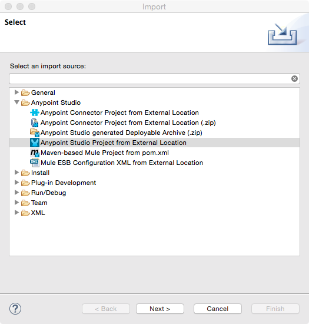
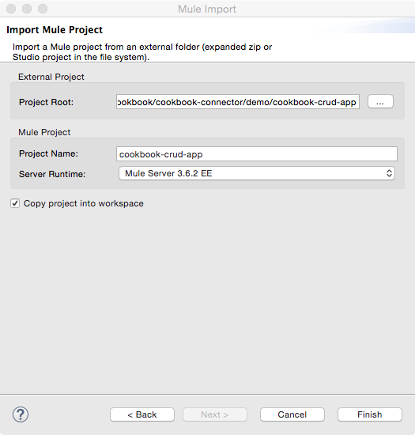
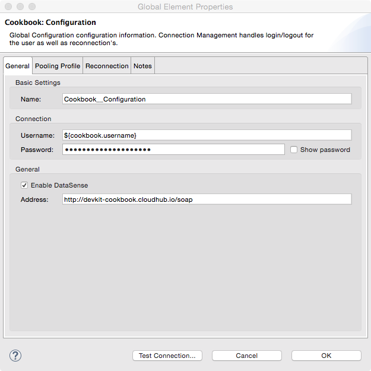
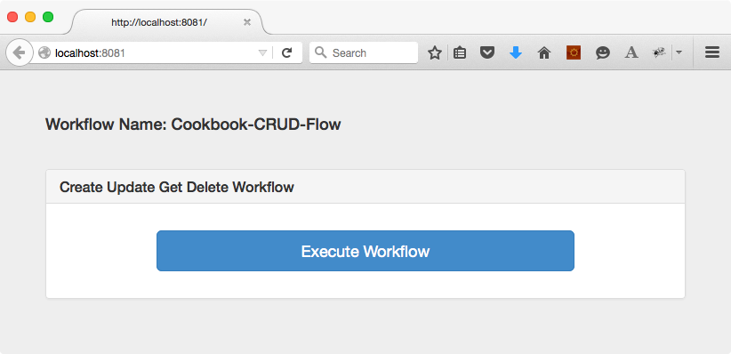
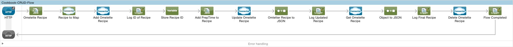

Cookbook Anypoint™ Studio Connector Demo
==========================================

## Introduction

The demo application provides a complete CRUD workflow using the Cookbook Connector, we start by creating
our recipe in the repository, update it with PrepTime, get the final recipe from repository and finally delete the recipe.

## Prerequisites

* Java 7 installed
* Mule Runtime 3.6.x. or higher
* Anypoint Studio 5.2.x
* Cookbook SDK Service Repository Credentials.

## Import the project

* Go to **File > Import**
* Select **Anypoint Studio Project from External Location** (under the parent folder "Anypoint Studio")



* Provide the root path to the demo project folder.
* Select Mule Runtime (3.6.x or higher).



* Click **Finish**.
* Set Cookbook credentials inside the file `src/main/app/mule-app.properties`.

```
cookbook.username=<USERNAME>
cookbook.password=<PASSWORD>
```
* Inside the Global Elements view, double-click the Cookbook Configuration component and click "Test Connection".



 * A successful message should pop-up.

* Select **Run as Mule Application**.

* Open a browser and access the URL `http://localhost:8081`. You should see the demo application deployed:



## About the flows

**Cookbook-CRUD-Flow:**



1. Creates a recipe to prepare an Omelette, Using the OmeletteRecipe Java Component we create the Recipe object along with the ingredients and the directions related to the recipe. **Recipe to Map transformer** is used to transform the Recipe object to a Map which forms the input to the cookbook connector's **create** operation.
2. We perform an **update** operation to update the preparation time attribute of the recipe that we have created and stored earlier in the cookbook repository.
3. Using the Identifier of the recipe returned by **create** operation we now use the **get** operation to retrieve recipe from the repository. The output is displayed in an JSON format on the browser.
4. Finally the flow ends by deleting the recipe we have created using the connector's **delete** operation.

## Run the demo

#### Create
* Click the link **"Cookbook CRUD Workflow"**.
* There is no user input for this demo. A sample recipe is considered as an input via the Java Component placed at the starting of the flow. To view or edit the recipe, refer to **OmletteRecipe** class located at **src/main/java/org/mule/cookbook**
* Click the **"Execute Workflow"** button and wait until the operation finishes processing.
* If the operation is successful, the recipe result would be shown in JSON format or else an alert popup stating the error.
